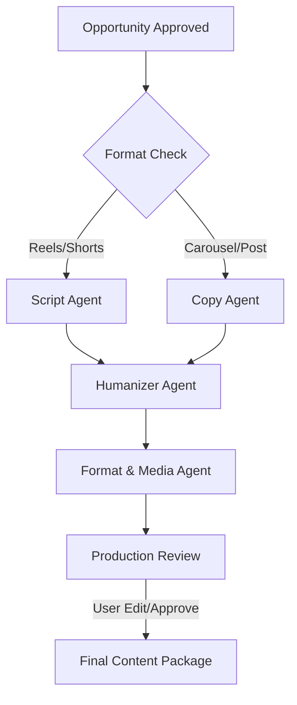

# 상세 설계: 콘텐츠 제작 자동화 파이프라인 (V2)

## 1. 개요 (Vision)
v1 시스템이 "무엇을 만들 것인가(Opportunity)"를 결정했다면, v2는 이를 바탕으로 **"최종 결과물(Final Deliverable)"**을 인간의 개입 없이(또는 최소화하여) 완성하는 제작 엔진입니다. 에이전트 간의 엄격한 역할 분담과 구조화된 데이터 전달을 통해 일관된 퀄리티를 보장합니다.

---

## 2. 제작 워크플로우 (Pipeline Architecture)

승인된 `OpportunityCard`를 입력으로 받아 아래의 **상태 기반 시퀀스**를 수행합니다.



### 단계별 상세 정의

#### [Phase 1] 콘텐츠 전략 구체화 (Strategy Expansion)
- **에이전트**: `strategy_agent` (v1 확장)
- **역할**: 승인된 기회의 '각도(Angle)'를 구체적인 '콘텐츠 지시서'로 변환.
- **출력**: `ProductionBrief` (타겟 감정, 핵심 메시지, 반드시 포함될 키워드, 피해야 할 클리셰).

#### [Phase 2] 초안 작성 (Drafting)
- **에이전트**: `copy_agent` (글 위주) / `script_agent` (영상 위주)
- **역할**: 
    - `copy_agent`: 인스타그램 캡션, 블로그 본문, 트위터 스레드 등 텍스트 중심 제작.
    - `script_agent`: 숏폼(릴스/쇼츠)용 2-3단계 후킹 구조 스크립트 작성 (비주얼 지시문 포함).
- **특징**: `operator-profile.md`의 톤앤매너 강제 적용.

#### [Phase 3] 인간미 주입 (Humanization)
- **에이전트**: `humanizer_agent` (신규)
- **역할**: AI 특유의 딱딱한 말투, 반복적인 패턴 제거. 구어체 적용 및 '공감 포인트' 강화.
- **스킬 연동**: `content-humanizer` 스킬의 로직을 프롬프트에 내재화.

#### [Phase 4] 포맷팅 및 미디어 에셋 (Formatting & Asset Prep)
- **에이전트**: `format_agent`
- **역할**: 
    - 최종 플랫폼 가이드라인에 맞춘 마크다운/JSON 변환.
    - **이미지 생성 프롬프트**: DALL-E 3 또는 Midjourney용 프롬프트 1~5개 생성.
    - 해시태그 최적화 (v1의 trend 데이터 활용).

---

## 3. 데이터 모델 (Data Schema)

### ContentPackage (신규)
```python
class ContentPackage(BaseModel):
    package_id: str
    source_card_id: str                   # 연결된 OpportunityCard ID
    status: str                           # "drafting", "reviewing", "ready"
    title: str                            # 내부 관리용 제목
    platform: str                         # "instagram_reels", "instagram_carousel", etc.
    
    # 제작 결과물
    main_text: str                        # 최종 캡션/본문
    script: list[dict[str, str]] | None   # [ { "scene": 1, "visual": "...", "audio": "..." } ]
    image_prompts: list[str]              # 이미지 생성용 프롬프트 목록
    hashtags: list[str]
    
    # 메타데이터
    estimated_viral_potential: int        # 예측 바이럴 점수 (0-100)
    tokens_used: int                      # 비용 추적용
    created_at: datetime
    updated_at: datetime
```

---

## 4. 에이전트 협업 프로토콜 (The "Relay" System)

에이전트 간 정보 전달 시 `accumulated_context`를 넘어선 **`RelayBuffer`**를 도입합니다.

1.  **Context Injection**: 이전 단계의 출력뿐만 아니라 `operator-profile.md`와 `OpportunityCard`의 원본 데이터를 매 단계마다 재주입하여 목적지 상실(Goal Drift) 방지.
2.  **Constraint Enforcement**: 각 단계에서 "반드시 지켜야 할 금기 사항(Negative Prompt)"을 체크리스트 형태로 전달.

---

## 5. UI/UX 구현 계획 (Mobile-First)

사용자가 폰 브라우저로 접속했을 때의 경험을 최적화합니다.

- **Production Feed**: 제작 중인 패키지의 상태를 프로그레스 바 형태로 표시.
- **One-Tap Review**: 생성된 원고를 읽고 '수정 요청' 또는 '최종 승인' 버튼 제공.
- **Copy-to-Clipboard**: 승인된 최종 원고를 터치 한 번으로 클립보드에 복사 (인스타그램 앱에 즉시 붙여넣기용).

---

## 6. 구현 우선순위 (Implementation Roadmap)

1.  **Step 1**: `ContentPackage` 모델 및 `production_store` 구현.
2.  **Step 2**: `script_agent` 및 `humanizer_agent` 프롬프트 고도화 (v1의 Sonnet 3.5 활용).
3.  **Step 3**: `orchestrator.py`에 `run_production_pipeline` 비동기 함수 추가.
4.  **Step 4**: 웹 UI에 제작 탭 및 결과물 뷰어 추가.

---

## 7. 검증 전략 (Quality Assurance)

- **AI-Self-Critique**: `format_agent`가 최종 결과물을 내놓기 전, `strategy_agent`에게 "당초 의도한 기회와 일치하는가?"를 묻는 교차 검증 로직 추가.
- **Consistency Test**: 동일한 `OpportunityCard`에 대해 5회 실행 시 톤앤매너가 일정하게 유지되는지 확인.
